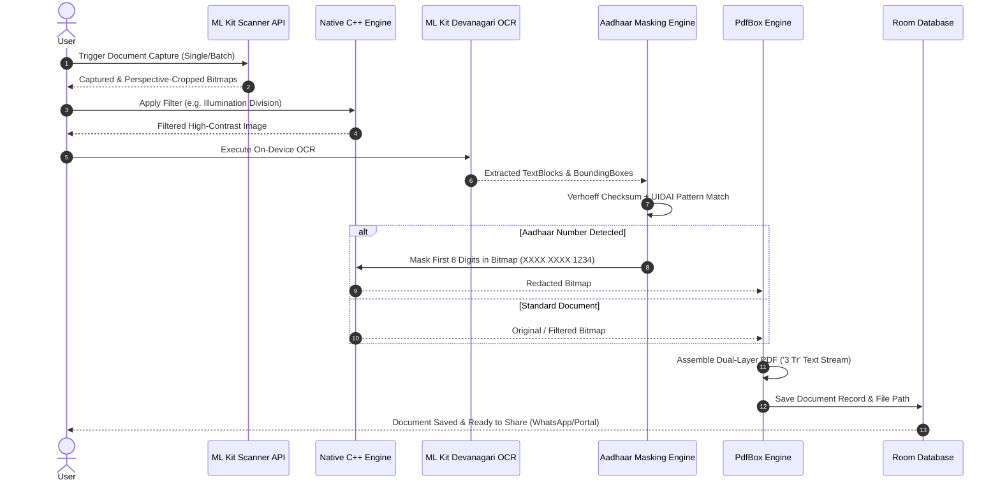

# Abhilekh (अभिलेख) — Sovereign Indian Document Scanner

[](https://www.android.com/)
[](https://kotlinlang.org/)
[-4285F4?logo=jetpackcompose&logoColor=white)](https://developer.android.com/jetpack/compose)
[](https://developer.android.com/ndk)
[-informational)](https://developer.android.com/about/versions/nougat)
[-blue)](https://developer.android.com/about/versions/15)
[](https://github.com/punitr2007/Abhilekh/actions/workflows/ci.yml)
[](https://github.com/punitr2007/Abhilekh/actions/workflows/release.yml)
[](LICENSE)

> **Abhilekh** is a sovereign, 100% offline-first document scanner and intelligent document processing engine engineered specifically for the Indian ecosystem. Built using modern native Android (Kotlin 2.1.0 + Jetpack Compose) and a high-performance C++ native image processing pipeline, Abhilekh combines Google ML Kit edge detection and on-device Devanagari OCR with automated Verhoeff-validated Aadhaar redaction, morphological illumination correction, and dual-layer searchable PDF generation.

---

## 📑 Table of Contents

- [Key Highlights](#-key-highlights)
- [Features](#-features)
  - [Core Document Scanning](#core-document-scanning)
  - [India-First Sovereign Intelligence](#india-first-sovereign-intelligence)
- [Tech Stack & Toolchain](#-tech-stack--toolchain)
- [Architecture & Design](#-architecture--design)
  - [System Architecture](#system-architecture)
  - [Data Flow](#data-flow)
- [Project Structure](#-project-structure)
- [Prerequisites](#-prerequisites)
- [Installation & Setup](#-installation--setup)
  - [1. Clone the Repository](#1-clone-the-repository)
  - [2. Configure Android SDK & Environment](#2-configure-android-sdk--environment)
  - [3. Build & Install via ADB](#3-build--install-via-adb)
  - [4. Open in Android Studio](#4-open-in-android-studio)
- [Usage & Key Workflows](#-usage--key-workflows)
- [Testing](#-testing)
- [Build Variants & Release](#-build-variants--release)
- [Contributing Guidelines](#-contributing-guidelines)
- [Roadmap](#-roadmap)
- [FAQ & Troubleshooting](#-faq--troubleshooting)
- [License & Acknowledgements](#-license--acknowledgements)

---

## 🌟 Key Highlights

- 🔒 **100% On-Device & DPDP Act 2023 Compliant:** Zero cloud lock-in, zero external telemetry, zero unauthorized data exfiltration. Every byte stays on the user's device.
- 🆔 **Multi-Signal Aadhaar Redaction:** Global Verhoeff checksum validation + contextual keyword anchors paired with native C++ pixel masking to ensure legal compliance without manual hassle.
- 💡 **Illumination Division Filters:** Custom native C++ morphological background estimation that eliminates harsh ambient shadows and LED glare from Indian office lighting.
- 📄 **Dual-Layer Invisible-Text Searchable PDFs:** Uses Apache PDFBox (`RenderingMode.NEITHER` / `3 Tr`) so PDFs look clean and authentic while remaining fully selectable and searchable.
- 🇮🇳 **Devanagari & Regional OCR:** Full on-device support for Hindi, Marathi, Sanskrit, and English without requiring active internet connectivity.

---

## 🚀 Features

### Core Document Scanning
- **ML Kit Edge Detection & Auto-Crop:** Real-time document boundary recognition with perspective correction.
- **High-Speed Burst Mode:** Multi-page capture stream optimized for rapid bulk digitization.
- **Advanced Document Filters:**
  - *Illumination Division (C++ Native):* Eliminates uneven lighting gradients across curved and crinkled pages.
  - *Clean B&W:* High-contrast binarization ideal for government applications and printouts.
  - *Grayscale & Color Boost:* Preserves stamp vibrancy and official seals.
- **Dual-Layer PDF Generation:** Embeds invisible searchable OCR text over original high-fidelity scans.
- **Document Merge & Reordering:** Intuitive multi-document combine and page reordering workflows.

### India-First Sovereign Intelligence
- **Automated Aadhaar Redaction:** Automatically detects 12-digit UID numbers across all pages, validates them against the Verhoeff algorithm, confirms contextual anchors (e.g., *UIDAI*, *Mera Aadhaar*, *DOB*), and irrevocably masks the first 8 digits (`XXXX XXXX 1234`).
- **Interactive Manual Redaction:** Canvas-based touch-redaction tool allowing users to scrub sensitive fields (PAN numbers, signatures, bank details) before sharing.
- **WhatsApp & Portal-Optimized Sharing:** 1-tap compression presets tuned for Indian portal limits (e.g., `< 200 KB` for UIDAI/EPFO, `< 1 MB` for passport/visa uploads).
- **Document Templates:** Capture framing tailored for standard Indian IDs (Aadhaar Card, PAN Card, Driving License, Vehicle RC, GST Invoices).

---

## 🛠 Tech Stack & Toolchain

| Layer | Technology | Description |
|---|---|---|
| **Primary Language** | Kotlin 2.1.0 | Modern idiomatic Android development |
| **Native Processing** | C++17 (NDK r27/r28) | High-performance computer vision & pixel manipulation via JNI |
| **UI Toolkit** | Jetpack Compose (BOM 2024.12.01) | Declarative reactive UI with Material Design 3 |
| **Architecture** | MVVM + Clean Architecture | Unidirectional Data Flow (UDF), Kotlin Coroutines & StateFlow |
| **Document Scanner** | Google ML Kit Document Scanner | `com.google.android.gms:play-services-mlkit-document-scanner:16.0.0-beta1` |
| **OCR Engines** | Google ML Kit Text Recognition | Latin (`19.0.1`) + Devanagari (`16.0.1`) for Hindi/Marathi/Sanskrit |
| **PDF Engine** | Apache PDFBox for Android | `com.tom_roush:pdfbox-android:2.0.27.0` (Dual-layer '3 Tr' PDF/A support) |
| **Local Persistence** | Jetpack Room 2.6.1 + KSP | SQLite abstraction for document metadata, pages, and search index |
| **Build System** | Gradle 8.9 + AGP 8.7.3 + CMake 3.22.1 | Modern Kotlin DSL build configuration |
| **Target Platforms** | Android (Min SDK 24, Target SDK 35) | Supports Android 7.0 (Nougat) through Android 15 |

---

## 🏛 Architecture & Design

### System Architecture

```
┌─────────────────────────────────────────────────────────────────┐
│                       UI / Presentation Layer                    │
│     (Jetpack Compose · Material 3 · ViewModels · Navigation)    │
│  [HomeScreen] ── [ManualRedactionScreen] ── [ExportBottomSheet] │
└───────────────────────────────┬─────────────────────────────────┘
                                │ StateFlow / Intents
┌───────────────────────────────▼─────────────────────────────────┐
│                       Domain & Core Engines                     │
├───────────────────────────────┬─────────────────────────────────┤
│    Computer Vision (CV)       │      Document Redaction         │
│  • OpenCVNativeBridge (JNI)   │  • AadhaarMaskingEngine         │
│  • native-lib.cpp (C++17)     │  • VerhoeffAlgorithm Checksum   │
│  • Illumination Division      │  • Multi-Signal Anchor Match    │
├───────────────────────────────┼─────────────────────────────────┤
│         OCR Manager           │         PDF Assembly            │
│  • ML Kit Latin Recognition   │  • PdfBoxEngine (Apache PDFBox) │
│  • ML Kit Devanagari Script   │  • RenderingMode.NEITHER (3 Tr) │
│  • Word-Level Bounding Boxes  │  • PDF Merge & Archival PDF/A   │
└───────────────────────────────┬─────────────────────────────────┘
                                │ Coroutines / Room DAO
┌───────────────────────────────▼─────────────────────────────────┐
│                       Data / Storage Layer                      │
│      • AppDatabase (Room 2.6.1)       • Encrypted SharedPreferences │
│      • DocumentEntity / PageEntity    • Scoped Internal Storage │
└─────────────────────────────────────────────────────────────────┘
```

### Data Flow



---

## 📁 Project Structure

```
Abhilekh/
├── .gitignore                      # Git ignore rules for Android, C++, Gradle, IDE
├── README.md                       # Main project documentation
├── Architecture.md                 # Architectural Decision Records (ADRs) & specs
├── PRD.md                          # Product Requirements Document
├── Design.md                       # UI/UX design tokens, layout hierarchy & themes
├── Memory.md                       # Architectural decisions & system constraints
├── phases.md                       # Engineering milestone roadmap
├── rules.md                        # Code conventions & quality gates
├── Building the desi Adobe Scan.md # Product strategy & competitive analysis
├── Ex_imgs/                        # Reference UI/UX test scans
└── android/                        # Native Android project root
    ├── build.gradle.kts            # Root build configuration
    ├── settings.gradle.kts         # Repository & plugin management
    ├── gradle.properties           # JVM args & AndroidX settings
    ├── local.properties            # Local Android SDK path (untracked)
    ├── gradlew / gradlew.bat       # Gradle wrapper executable
    ├── gradle/
    │   ├── libs.versions.toml      # Dependency Version Catalog
    │   └── wrapper/                # Gradle wrapper JAR & properties (v8.9)
    └── app/
        ├── build.gradle.kts        # Module build configuration (SDK 35, NDK, KSP)
        ├── src/main/
        │   ├── AndroidManifest.xml # App manifest & permissions
        │   ├── cpp/                # Native C++ layer
        │   │   ├── CMakeLists.txt  # CMake build instructions
        │   │   └── native-lib.cpp  # Illumination division & pixel masking
        │   ├── res/                # App resources (strings, XML file paths)
        │   └── java/com/abhilekh/app/
        │       ├── AbhilekhApplication.kt # Application lifecycle & initialization
        │       ├── MainActivity.kt        # Scanner launch, photo picker, view models
        │       ├── core/
        │       │   ├── cv/
        │       │   │   └── OpenCVNativeBridge.kt   # JNI bridge to native C++
        │       │   ├── masking/
        │       │   │   ├── AadhaarMaskingEngine.kt # Global Aadhaar detector & masker
        │       │   │   └── VerhoeffAlgorithm.kt    # Dihedral D5 Verhoeff checksum
        │       │   ├── ocr/
        │       │   │   └── OcrManager.kt           # ML Kit Latin & Devanagari OCR
        │       │   └── pdf/
        │       │       └── PdfBoxEngine.kt         # Searchable PDF & merge engine
        │       ├── data/
        │       │   └── db/
        │       │       ├── AppDatabase.kt          # Room Database definition
        │       │       └── DocumentEntity.kt       # Entity schema & Room DAO
        │       └── ui/
        │           ├── screens/
        │           │   ├── HomeScreen.kt           # Document list, actions, empty states
        │           │   └── ManualRedactionScreen.kt# Touch-to-redact canvas screen
        │           └── theme/
        │               ├── Theme.kt                # Material3 color schemes
        │               └── AbhilekhTheme.kt        # Theme provider & status bar styling
```

---

## 📋 Prerequisites

Ensure your development environment meets the following specifications:

- **Operating System:** Linux (Ubuntu 22.04+ / Arch / Fedora), macOS (Sonoma+), or Windows 11 with WSL2
- **JDK:** OpenJDK 17 or JDK 22 (configured via `JAVA_HOME`)
- **Android SDK:**
  - Android SDK Platform `android-35` (or `android-36`)
  - Android SDK Build-Tools `36.0.0` or `37.0.0`
  - Android SDK Platform-Tools (ADB)
- **Android NDK & CMake:**
  - NDK `27.0.12077973` or `28.2.13676358`
  - CMake `3.22.1`
- **Android Studio (Recommended):** Android Studio Koala / Ladybug or newer
- **Physical Test Device:** Android device running Android 7.0+ (API 24+) with **USB Debugging** enabled.

---

## 💻 Installation & Setup

### 1. Clone the Repository

```bash
git clone git@github.com:punitr2007/Abhilekh.git
cd Abhilekh
```

### 2. Configure Android SDK & Environment

Set your environment variables in `~/.bashrc` or `~/.zshrc`:

```bash
export ANDROID_HOME="$HOME/Android/Sdk"
export ANDROID_SDK_ROOT="$HOME/Android/Sdk"
export PATH="$ANDROID_HOME/platform-tools:$ANDROID_HOME/tools:$ANDROID_HOME/tools/bin:$PATH"
export JAVA_HOME="/usr/lib/jvm/jdk-22.0.2" # or /usr/lib/jvm/java-17-openjdk
export PATH="$JAVA_HOME/bin:$PATH"
```

Create or verify `android/local.properties`:

```properties
sdk.dir=/home/punit/Android/Sdk
```

### 3. Build & Install via ADB

Ensure your physical device is connected via USB and authorized:

```bash
# Check connected devices
adb devices

# Build and install the debug APK directly to the device
cd android
./gradlew installDebug --no-daemon
```

Alternatively, build the standalone debug APK:

```bash
./gradlew assembleDebug --no-daemon

# Install using ADB
adb install -r app/build/outputs/apk/debug/app-debug.apk
```

### 4. Open in Android Studio

1. Launch Android Studio.
2. Select **File → Open** and choose the `Abhilekh/android` directory.
3. Allow Gradle to perform the initial sync and indexing.
4. Select your connected physical device from the device dropdown and click **Run (Shift + F10)**.

---

## 📱 Usage & Key Workflows

### 1. Document Scanning
- Tap the **Camera Floating Action Button** on the Home screen to launch the Google ML Kit Document Scanner.
- The scanner will automatically detect document boundaries and apply perspective correction.
- Tap **Save** to ingest the multi-page scan into Abhilekh.

### 2. Illumination Correction & Filtering
- In the document editor, select **Illumination Division** from the filter carousel.
- The C++ native engine estimates non-uniform background brightness and normalizes lighting gradients across the entire page.

### 3. Aadhaar Redaction Workflow
- On-device OCR processes all scanned pages automatically.
- Any 12-digit number matching UIDAI syntax and passing the Verhoeff checksum algorithm is detected.
- The app offers a **1-Tap Mask** action that overwrites the first 8 digits in the raw image bitmap with `XXXX XXXX` redaction bars and sanitizes the underlying PDF text stream.
- For non-standard IDs, launch the **Manual Redaction Screen** to drag and draw black redaction boxes over custom fields.

### 4. Searchable PDF Export
- Tap **Export PDF** on any document.
- Choose your target format:
  - **Standard Searchable PDF (A4):** Dual-layer format with invisible text layer (`3 Tr`) for instant searchability.
  - **Compressed Share (WhatsApp):** Downsamples images to fit under target size limits (e.g. `< 1 MB`).
  - **Archival Mode (PDF/A-1b):** Embeds strict archival metadata for government or legal submissions.

---

## 🧪 Testing

### Run Unit Tests
Execute the local unit test suite (including Verhoeff algorithm tests, regex parsers, and view model logic):

```bash
cd android
./gradlew testDebugUnitTest
```

### Run Instrumentation Tests
Execute on-device instrumentation tests on your connected physical phone or emulator:

```bash
./gradlew connectedDebugAndroidTest
```

### Aadhaar Masking Test Cases
The Verhoeff algorithm and multi-signal validator are verified against standard UIDAI test matrices:
- `✓` Valid UID with spaces: `1234 5678 9012`
- `✓` Valid UID with hyphens: `1234-5678-9012`
- `✓` Context anchor validation (`Mera Aadhaar`, `DOB`, `UIDAI`)
- `✗` Rejection of invalid checksum numbers (e.g. phone numbers, tracking IDs)

---

## 📦 Build Variants & Release

| Build Variant | Application ID | Minification (R8) | Shrink Resources | Purpose |
|---|---|---|---|---|
| **Debug** | `com.abhilekh.app.debug` | Disabled | Disabled | Local development, rapid testing, and ADB debugging |
| **Release** | `com.abhilekh.app` | **Enabled** | **Enabled** | Production builds optimized for size and performance |

To assemble a signed release APK or Android App Bundle (AAB):

```bash
# Release APK
./gradlew assembleRelease

# Release AAB (for Google Play Store / F-Droid)
./gradlew bundleRelease
```

---

## 🤝 Contributing Guidelines

We welcome contributions from the open-source community! To contribute:

1. **Fork the Repository** on GitHub.
2. **Create a Feature Branch:**
   ```bash
   git checkout -b feature/your-feature-name
   # or
   git checkout -b fix/issue-description
   ```
3. **Commit Conventions:** Follow [Conventional Commits](https://www.conventionalcommits.org/):
   - `feat: add Tamil script OCR support`
   - `fix: correct bounding box offset in landscape PDF export`
   - `docs: update setup guide for NDK 28`
   - `perf: optimize JNI bitmap pixel buffer copying`
4. **Code Quality Standards:**
   - Adhere to official Kotlin and Android coding conventions.
   - Run `./gradlew compileDebugKotlin` to ensure clean builds with zero compiler warnings.
   - Maintain full offline compatibility (no unauthorized network requests).
5. **Submit a Pull Request** describing your changes, test evidence, and related issue numbers.

---

## 🗺 Roadmap

- [x] **Phase 1: Foundation & Core Scaffolding** *(Completed)*
  - [x] Native Android Kotlin + Compose architecture setup
  - [x] C++ Native Image Processing bridge (`OpenCVNativeBridge`, Illumination Division)
  - [x] ML Kit Document Scanner & Devanagari OCR integration
  - [x] Verhoeff-based Aadhaar detection & redaction engine
  - [x] Apache PDFBox dual-layer searchable PDF generation
  - [x] Jetpack Room local persistence
- [ ] **Phase 2: UI Polish & Enhanced Indian Document Intelligence** *(In Progress)*
  - [ ] 7-mode viewfinder top/bottom bar (Document, Book, Whiteboard, ID Card, GST Bill, Aadhaar/PAN)
  - [ ] Real-time filter preview carousel
  - [ ] PAN card format verification & GST invoice tax itemizer
  - [ ] Additional regional language OCR packs (Tamil, Telugu, Bengali, Gujarati)
- [ ] **Phase 3: Ecosystem & Sovereign Cloud**
  - [ ] Official DigiLocker partner integration
  - [ ] CA / Tax accountant export bundles with ZIP + password protection
  - [ ] Encrypted WebDAV / Nextcloud opt-in backup

---

## ❓ FAQ & Troubleshooting

<details>
<summary><b>1. Gradle error: <code>Unresolved reference 'tom_roush'</code></b></summary>
Ensure you are importing from <code>com.tom_roush.pdfbox.*</code> (with an underscore) and that <code>com.tom-roush:pdfbox-android:2.0.27.0</code> is properly declared in <code>gradle/libs.versions.toml</code>.
</details>

<details>
<summary><b>2. CMake Warning: <code>[CXX5304] SDK XML version 4 encountered</code></b></summary>
This is an informational warning indicating a minor version skew between NDK 28's metadata parser and CMake 3.22.1. It does not affect compilation or runtime binary execution.
</details>

<details>
<summary><b>3. <code>adb devices</code> shows unauthorized or empty list</b></summary>
Unlock your Android device and look for the <i>"Allow USB Debugging?"</i> authorization dialog. Check <i>"Always allow from this computer"</i> and tap OK. Restart the ADB server if needed:
<pre><code>adb kill-server && adb start-server</code></pre>
</details>

<details>
<summary><b>4. ML Kit Document Scanner fails to launch</b></summary>
The ML Kit Document Scanner API relies on Google Play Services on the host device. Ensure Google Play Services is updated to the latest version on your physical test device.
</details>

---

## 📄 License & Acknowledgements

This project is licensed under the **Apache License 2.0** — see the [LICENSE](LICENSE) file for details.

### Acknowledgements
- **Google Play Services ML Kit Team** for on-device Document Scanner & Text Recognition APIs.
- **Tom Roush** for the [PDFBox-Android](https://github.com/TomRoush/PdfBox-Android) port.
- **The OpenCV & Android Open Source Project (AOSP)** communities.

---

<p align="center">
  <b>Built with ❤️ for a Sovereign, Privacy-First Digital India 🇮🇳</b><br>
  Maintained by <a href="https://github.com/punitr2007">@punitr2007</a>
</p>
